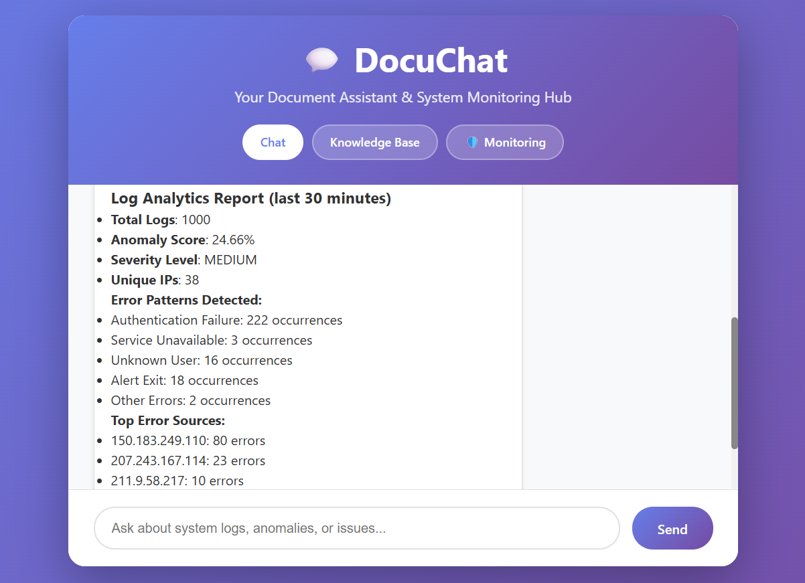

# Docuchat 🚀

**Docuchat** is an advanced Log Monitoring AI Assistant built with **FastAPI** and **React**. Designed to provide comprehensive system observability, it leverages the **Google AI Agent SDK (ADK)** to orchestrate specialized agents that track, analyze, and resolve issues across various log sources.

## ✨ Key Features

- 🤖 **Agentic Orchestration**: Powered by **Google ADK** for sophisticated multi-agent flows and decision-making.
- 🪵 **Multi-Source Log Tracking**: Dynamically tracks **Linux logs**, **server logs**, and **container logs** to ensure full system visibility.
- 📊 **Metric Monitoring**: Real-time tracking of container metrics and system health.
- � **Deep Log Analysis**: Integrated with **Grafana Loki** to fetch, search, and analyze logs with high efficiency.
- � **Visual Insights**: Uses **Grafana** dashboards to visualize both metrics and log patterns for easier troubleshooting.
- 💡 **Automated Root Cause Analysis**: Specialized agents that detect anomalies and recommend actionable solutions.

## 📸 Screenshots

*(Screenshots and UI demonstrations will be added here)*

- **AI Incident Assistant Chat Interface**

- **Grafana Monitoring Dashboard**

